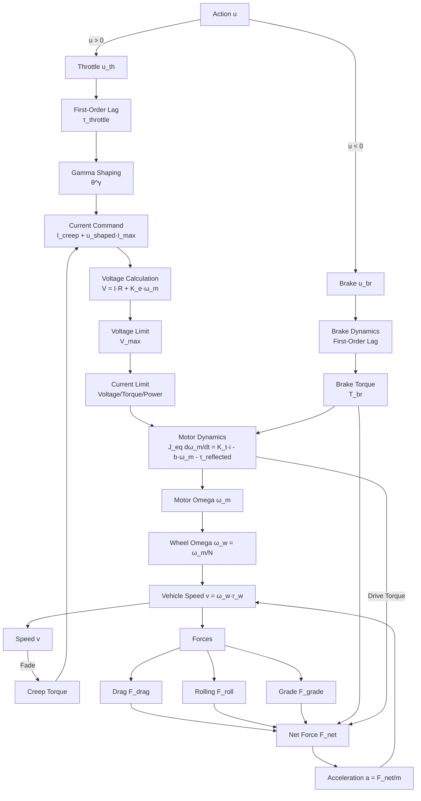
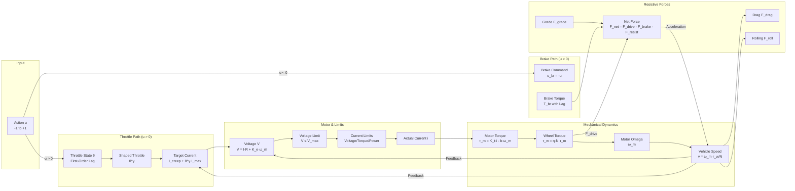
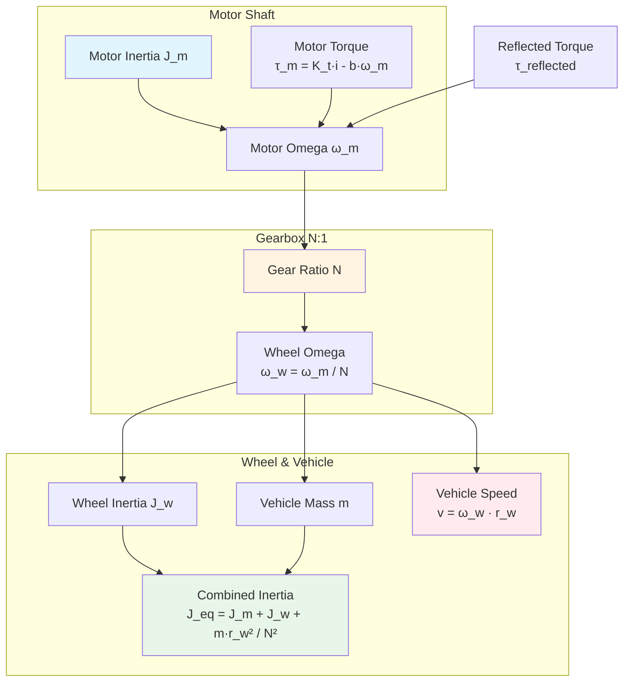
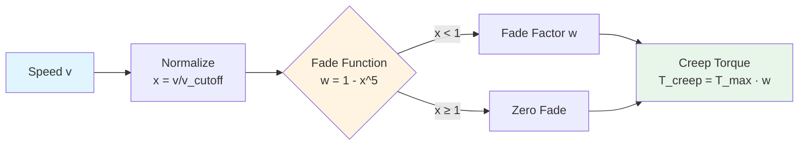
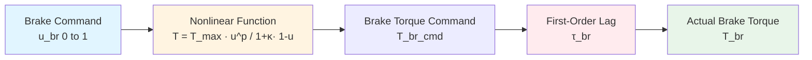
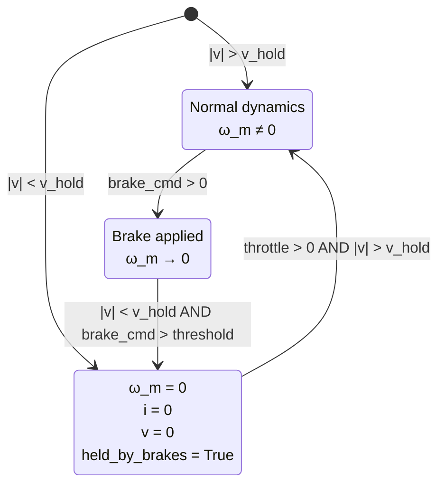
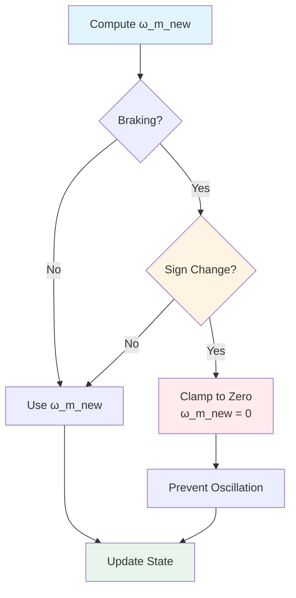

# Dynamics Model Documentation

## Overview

The simulation uses an **ExtendedPlant** model that includes:

- **DC Motor**: First-order electrical dynamics with back-EMF
- **Throttle Dynamics**: First-order lag with nonlinear shaping (gamma)
- **Nonlinear Braking**: Slip-dependent brake torque with time constant
- **Wheel Dynamics**: Rotational inertia and tire forces
- **Aerodynamic Drag**: Speed-squared drag force
- **Rolling Resistance**: Speed-dependent rolling friction
- **Road Grade**: Gravitational force component
- **Creep Torque**: EV-style low-speed forward motion
- **Current/Power/Voltage Limits**: Multi-constraint enforcement

### System Architecture



### Signal Flow Diagram



## Physics Equations

### Motor Dynamics

The motor uses a DC motor model with the following equations:

#### Electrical Equations

- **Voltage equation**: `V = R·i + K_e·ω_m`
  - `V`: Applied motor voltage (V)
  - `R`: Armature resistance (Ω)
  - `i`: Motor current (A)
  - `K_e`: Back-EMF constant (V·s/rad)
  - `ω_m`: Motor angular speed (rad/s)

- **Torque equation**: `τ_m = K_t·i - b·ω_m`
  - `τ_m`: Motor shaft torque (Nm)
  - `K_t`: Torque constant (Nm/A) - **Note**: In SI units, `K_e = K_t`
  - `b`: Viscous friction coefficient (Nm·s/rad)
  - Negative current is clamped to zero (no regeneration)

- **Wheel torque**: `τ_w = η_gb·N·τ_m`
  - `τ_w`: Torque at wheel (Nm)
  - `η_gb`: Gearbox efficiency (dimensionless)
  - `N`: Gear ratio (dimensionless)

#### Mechanical Dynamics

The system uses a **single-DOF rigid coupling** model:

- **Combined inertia**: `J_eq = J_m + (J_w + m·r_w²) / N²`
  - `J_m`: Motor rotor inertia (kg·m²)
  - `J_w`: Wheel inertia (kg·m²)
  - `m`: Vehicle mass (kg)
  - `r_w`: Wheel radius (m)
  - The wheel and vehicle mass inertias are **divided by N²** (not multiplied) because the motor spins N times faster than the wheel, reducing reflected inertia by N² (from energy conservation)

- **Motor dynamics**: `J_eq · dω_m/dt = K_t·i - b·ω_m - τ_reflected`
  - `τ_reflected`: Total opposing torque reflected to motor shaft (Nm)
  - `ω_m` is the **single source of truth**; vehicle speed is derived from it: `v = (ω_m / N) · r_w`

**Motor-Wheel Coupling:**



**Energy Conservation Explanation:**

The reflected inertia is divided by N² because:
- Motor energy: `E_m = 0.5 · J_m · ω_m²`
- Wheel energy: `E_w = 0.5 · J_w · ω_w² = 0.5 · J_w · (ω_m/N)² = 0.5 · (J_w/N²) · ω_m²`
- Vehicle energy: `E_v = 0.5 · m · v² = 0.5 · m · (ω_w·r_w)² = 0.5 · (m·r_w²/N²) · ω_m²`
- Total: `E_total = 0.5 · [J_m + J_w/N² + m·r_w²/N²] · ω_m²`

### Throttle Dynamics

The throttle command undergoes two transformations before affecting motor current:

#### 1. First-Order Lag (Throttle Delay)

The throttle command `u_th` (0 to 1) is filtered through a first-order lag to model actuator delay:

```
τ_throttle · dθ/dt = θ_cmd - θ
```

Discretized for simulation:
```
θ_new = θ_old + (θ_cmd - θ_old) · (dt / (τ_throttle + dt))
```

Where:
- `θ_cmd = u_th`: Commanded throttle (0 to 1)
- `θ`: Filtered throttle state (0 to 1)
- `τ_throttle`: Throttle time constant (s) - typically 0.05-0.30s

This introduces realistic delay between throttle command and actual motor response.

#### 2. Nonlinear Shaping (Gamma)

The filtered throttle is then shaped by a power function:

```
u_th_shaped = θ^γ
```

Where:
- `γ = gamma_throttle`: Throttle nonlinearity exponent (typically 0.5-2.0)
- `γ < 1`: More low-end response (easier to get moving from rest)
- `γ = 1`: Linear response
- `γ > 1`: Reduced low-end response (requires more throttle for initial acceleration)

This allows tuning the throttle feel to match different vehicle characteristics.

#### Current Command

The shaped throttle is converted to a current command:

```
target_current = I_creep + u_th_shaped · I_max
```

Where:
- `I_creep`: Creep current (see Creep Torque section)
- `I_max`: Maximum current limit (see Limits section)

### Creep Torque

EV-style creep provides low-speed forward motion at zero throttle, mimicking ICE idle behavior without introducing idle RPMs or discontinuities.

#### Creep Force to Torque Conversion

Creep is parameterized by maximum acceleration `a_max`:

```
F_creep_max = m · a_max          [N]  Maximum creep force
T_wheel_creep_max = F_creep_max · r_w  [Nm] Maximum creep torque at wheel
T_motor_creep_max = T_wheel_creep_max / (N · η_gb)  [Nm] Maximum creep torque at motor shaft
```

#### Speed-Dependent Fade

Creep torque fades smoothly with vehicle speed using a power function:

```
x = |v| / v_cutoff
w_fade = 1 - x^5    if x < 1
w_fade = 0          if x ≥ 1
```

Where:
- `v`: Current vehicle speed (m/s)
- `v_cutoff`: Speed where creep fully fades out (typically 1.5 m/s)
- The `x^5` power function provides a very gentle fade, maintaining ~97% torque at x=0.5 and ~33% at x=0.925

**Creep Fade Curve:**



**Fade Characteristics:**
- At v = 0: w = 1.0 (100% creep torque)
- At v = 0.5·v_cutoff: w ≈ 0.97 (97% torque)
- At v = 0.75·v_cutoff: w ≈ 0.76 (76% torque)
- At v = v_cutoff: w = 0.0 (0% torque)

#### Brake Interaction

Brake torque subtracts from creep torque:

```
T_creep_motor = max(0, T_motor_creep_max · w_fade - τ_brake_motor_mag)
```

Where `τ_brake_motor_mag` is the brake torque magnitude reflected to motor shaft.

#### Standstill Threshold

At very low speeds (`|v| < v_hold`, typically 0.08 m/s), the vehicle is considered at standstill. Brakes can hold the vehicle at rest, clamping motor omega to zero to prevent oscillation.

#### Creep Current

Creep torque is converted to equivalent current for current control:

```
I_creep = T_creep_motor / K_t
```

Creep is **always active** and adds to throttle current, ensuring smooth low-speed behavior.

### Current, Power, and Voltage Limits

The motor enforces three types of limits simultaneously:

#### 1. Voltage Limit

The maximum voltage `V_max` limits current through back-EMF:

```
V_required = I_target · R + K_e · ω_m
V_applied = min(V_required, V_max)
```

The voltage-limited current is:

```
i_limit_voltage = (V_max - K_e · ω_m) / R
i_limit_voltage = max(i_limit_voltage, 0)  [No regeneration]
```

At high speeds, back-EMF reduces available voltage, limiting current even if `V_max` is applied.

#### 2. Torque Limit (Optional)

If `T_max` is specified, it limits motor torque:

```
I_max_torque = T_max / K_t
```

This is typically used to model motor controller torque limits.

#### 3. Power Limit (Optional)

If `P_max` is specified, it limits motor power:

```
I_max_power = P_max / V_applied    if V_applied > 0
I_max_power = ∞                    if V_applied = 0
```

This models motor controller power limits.

#### Combined Limit Enforcement

The system enforces limits in two stages:

**Stage 1: Compute maximum current limit**

First, determine the base maximum current from torque limit (if specified):

```
I_max_base = T_max / K_t    if T_max specified
I_max_base = V_max / R      if T_max not specified
```

**Stage 2: Apply voltage and power limits to actual current**

After computing the target current and required voltage, the actual current is limited by:

1. **Voltage limit** (accounts for back-EMF at current speed):
   ```
   i_limit_voltage = (V_max - K_e · ω_m) / R
   i_limit_voltage = max(i_limit_voltage, 0)  [No regeneration]
   ```

2. **Torque limit** (if specified):
   ```
   I_max_torque = T_max / K_t
   ```

3. **Power limit** (if specified):
   ```
   I_max_power = P_max / V_applied    if V_applied > 0
   ```

The effective current limit is:

```
i_effective_limit = min(i_limit_voltage, I_max_torque, I_max_power)
```

Where any unspecified limit is treated as ∞.

**Current Command and Application**

The target current command is:

```
target_current = I_creep + u_th_shaped · I_max_base
```

The voltage required to achieve this current is:

```
V_required = target_current · R + K_e · ω_m
V_applied = min(V_required, V_max)
```

The actual current is then computed from the applied voltage and clamped to the effective limit:

```
i_steady = (V_applied - K_e · ω_m) / R
i_actual = min(i_steady, i_effective_limit)
i_actual = max(i_actual, 0)  [No regeneration]
```

This ensures that all three limits (voltage, torque, power) are respected simultaneously, with voltage limiting becoming more restrictive at higher speeds due to back-EMF.

### Vehicle Forces

#### Drive Force

```
F_drive = τ_w / r_w
```

Where `τ_w` is the drive torque at wheel.

#### Drag Force

```
F_drag = 0.5 · ρ · CdA · v²
```

Where:
- `ρ`: Air density (kg/m³), default 1.225 kg/m³
- `CdA`: Drag coefficient × frontal area (m²)
- `v`: Vehicle speed (m/s)

#### Rolling Resistance

Rolling resistance is speed-dependent with a smooth transition:

```
roll_factor = min(1.0, |v| / v_threshold)
F_roll = C_rr · m · g · roll_factor
```

Where:
- `C_rr`: Rolling resistance coefficient (dimensionless)
- `v_threshold`: Speed threshold for full rolling resistance (typically 0.1 m/s)
- At very low speeds, rolling resistance is reduced to prevent excessive resistance at standstill

#### Grade Force

```
F_grade = m · g · sin(θ_grade)
```

Where `θ_grade` is the road grade angle (radians, positive for uphill).

#### Net Force

```
F_net = F_tire - F_drag - F_roll - F_grade
```

Where `F_tire` is the tire contact force (see Brake Dynamics section).

### Brake Dynamics

#### Brake Torque Command

The brake command `u_br` (0 to 1) is converted to brake torque using a nonlinear function:

```
T_br_cmd = T_br_max · (u_br^p) / (1 + κ · (1 - u_br))
```

Where:
- `T_br_max`: Maximum brake torque (Nm)
- `p`: Brake exponent (typically 1.0-1.8)
- `κ`: Brake slip constant (typically 0.02-0.25)

The denominator term `1 + κ·(1 - u_br)` models slip-dependent brake effectiveness, reducing brake torque at low brake commands.

**Brake Command to Torque:**



**Brake Nonlinearity Effect:**

- **Low brake** (u_br = 0.1): Denominator ≈ 1.09, reduces torque by ~9%
- **Medium brake** (u_br = 0.5): Denominator ≈ 1.045, reduces torque by ~4.5%
- **High brake** (u_br = 1.0): Denominator = 1.0, full torque

#### First-Order Lag

Brake torque follows the command with a first-order lag:

```
τ_br · dT_br/dt = T_br_cmd - T_br
```

Discretized:
```
T_br_new = T_br_old + (T_br_cmd - T_br_old) · (dt / τ_br)
```

Where `τ_br` is the brake time constant (typically 0.04-0.12s).

#### Brake Direction Logic

Brake torque opposes current motion direction:

- **Moving forward** (`v > v_eps`): `τ_brake_wheel = +T_br` (opposes forward)
- **Moving backward** (`v < -v_eps`): `τ_brake_wheel = -T_br` (opposes backward)
- **At rest** (`|v| < v_hold`): Smooth interpolation to prevent oscillation

At very low speeds with brakes applied, the vehicle is held at rest (`held_by_brakes = True`), and motor omega is clamped to zero.

#### Tire Force with Friction Limit

The tire contact force is limited by friction:

```
F_tire_raw = F_drive - F_brake
F_tire = clip(F_tire_raw, -μ·m·g, +μ·m·g)
```

Where `μ` is the tire friction coefficient (typically 0.7-1.0).

### State Update

The simulation uses a **single-DOF rigid coupling** model where `ω_m` is the single source of truth:

1. **Motor omega update**: `ω_m_new = ω_m_old + dt · dω_m/dt`
2. **Vehicle speed**: `v = (ω_m / N) · r_w`
3. **Wheel omega**: `ω_w = ω_m / N`
4. **Position**: `x_new = x_old + v · dt`

At very low speeds with brakes applied, `ω_m` is clamped to zero to prevent oscillation.

## Parameters

### Motor Parameters (`MotorParams`)

- `R`: Armature resistance (Ω) - typically 0.02-0.6 Ω
- `K_e`, `K_t`: Back-EMF and torque constants (V·s/rad, Nm/A) - must be equal in SI units, typically 0.05-0.4
- `b`: Viscous friction coefficient (Nm·s/rad) - typically 1e-6 to 5e-3
- `J`: Rotor inertia (kg·m²) - typically 1e-4 to 1e-2
- `V_max`: Maximum motor voltage (V) - typically 200-800 V
- `T_max`: Maximum motor torque (Nm, optional) - limits current via `I_max = T_max / K_t`
- `P_max`: Maximum motor power (W, optional) - limits current via `I_max = P_max / V`
- `gamma_throttle`: Throttle nonlinearity exponent (dimensionless) - typically 0.5-2.0, default 1.0
- `throttle_tau`: Throttle time constant (s) - typically 0.05-0.30s, default 0.1s
- `gear_ratio`: Gear reduction ratio (dimensionless) - typically 4.0-20.0
- `eta_gb`: Gearbox efficiency (dimensionless) - typically 0.85-0.98

### Brake Parameters (`BrakeParams`)

- `T_br_max`: Maximum brake torque (Nm) - typically 5000-12000 Nm
- `p_br`: Brake exponent (dimensionless) - typically 1.0-1.8
- `tau_br`: Brake time constant (s) - typically 0.04-0.12s
- `kappa_c`: Brake slip constant (dimensionless) - typically 0.02-0.25
- `mu`: Tire friction coefficient (dimensionless) - typically 0.7-1.0

### Body Parameters (`BodyParams`)

- `mass`: Vehicle mass (kg) - typically 1500-6000 kg
- `drag_area`: Drag coefficient × frontal area (m²) - typically 0.2-0.8 m²
- `rolling_coeff`: Rolling resistance coefficient (dimensionless) - typically 0.007-0.015
- `grade_rad`: Road grade angle (radians) - positive for uphill
- `air_density`: Air density (kg/m³) - default 1.225 kg/m³

### Wheel Parameters (`WheelParams`)

- `radius`: Wheel radius (m) - typically 0.26-0.38 m
- `inertia`: Wheel + rotating assembly inertia (kg·m²) - typically 0.5-5.0 kg·m²
- `v_eps`: Speed threshold for slip calculation (m/s) - default 0.1 m/s

### Creep Parameters (`CreepParams`)

- `a_max`: Maximum creep acceleration (m/s²) - typically 0.3-0.7 m/s², default 0.5 m/s²
- `v_cutoff`: Speed where creep fully fades out (m/s) - typically 1.0-2.0 m/s, default 1.5 m/s
- `v_hold`: Standstill threshold (m/s) - typically 0.05-0.15 m/s, default 0.08 m/s

## Limitations

- **No regeneration**: Negative current is clamped to zero (`i ≥ 0`)
- **Single-DOF rigid coupling**: Motor always coupled to wheel via gearbox (no clutch/slip)
- **Quasi-steady-state electrical dynamics**: No `di/dt` term (assumes electrical dynamics are much faster than mechanical)
- **Simplified tire model**: Friction limit only (no detailed slip dynamics)
- **No transmission**: Single gear ratio (no gear shifting)
- **Rigid body**: No suspension dynamics or weight transfer

## Numerical Implementation

### Time Stepping

The simulation uses explicit Euler integration with optional sub-stepping:

```
for substep in range(substeps):
    dt_sub = dt / substeps
    _substep(action, dt_sub)
```

This allows smaller time steps for numerical stability while maintaining the desired output time step.

### Zero-Speed Handling

At very low speeds with brakes applied, the system clamps motor omega to zero to prevent numerical oscillation:

```
if |v| < v_hold and brake_cmd > threshold:
    ω_m = 0
    i = 0
    v = 0
    held_by_brakes = True
```

This ensures stable behavior at standstill.

**Zero-Speed State Machine:**



### Sign Change Prevention

When braking, the system prevents motor omega from crossing zero to avoid oscillation:

```
if braking and sign(ω_m_old) ≠ sign(ω_m_new):
    ω_m_new = 0
```

This maintains stability during brake application at low speeds.

**Sign Change Prevention Logic:**


