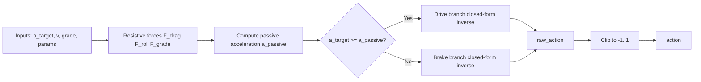

# Analytic Inverse Feedforward Model

## Overview

This module computes feedforward actuation from a target longitudinal acceleration using **analytic inversion** of the plant equations.

Design choices:
- No search, no bisection, no root solving.
- No internal feasibility clipping from voltage/torque/power constraints.
- Only final output clipping: `action = clip(raw_action, -1, 1)`.
- Delay and stability-hack logic is intentionally excluded from the inverse path.

## Signal Flow

## Branching Logic

The inverse uses a passive baseline from the clean forward equations with zero brake and floor current:

`dω_passive = (K_t*i_floor - b*ω_m - T_tire/(η_gb*N)) / J_eq`

`a_passive = (r_w/N) * dω_passive`

Branch selection:
- Drive branch when `a_target >= a_passive`
- Brake branch when `a_target < a_passive`

## Model Equations

### Shared Terms

`ω_m = (N/r_w) * v`

`dω_target = (N/r_w) * a_target`

`J_eq = J_m + (J_w + m*r_w^2)/N^2`

`F_drag = 0.5 * ρ * CdA * v * |v|`

`roll_factor = min(1, |v|/0.1)`

`F_roll = C_rr * m * g * roll_factor`

`F_grade = m * g * sin(grade)`

`T_tire = (F_drag + F_roll + F_grade) * r_w`

### Drive Branch Inversion

Required motor current from closed-form inversion:

`i_req = (J_eq*dω_target + b*ω_m + T_tire/(η_gb*N)) / K_t`

Throttle-current mapping upper bound (used as scaling only):

`i_upper = min(V_max/R, T_max/K_t if set)`

`i_floor = max(min_current_A, 0)`

`i_span = max(i_upper - i_floor, 0)`

`u_th_raw = max((i_req - i_floor)/i_span, 0)^(1/gamma_throttle)`

`raw_action = u_th_raw`

### Brake Branch Inversion

With simplified brake law `T_br = T_br_max * u_br^p_br`, the inverse is closed form.

Signed required brake torque at wheel:

`T_br_signed = η_gb*N*(K_t*i_floor - b*ω_m - J_eq*dω_target) - T_tire`

Magnitude (opposing motion direction):

`T_br_mag = max(sign(v) * T_br_signed, 0)`

Brake command:

`u_br_raw = (T_br_mag / T_br_max)^(1/p_br)`

`raw_action = -u_br_raw`

### Output

Final command is the only enforced limit:

`action = clip(raw_action, -1, 1)`

## API

Primary API in `simulation.inverse_dynamics`:
- `AnalyticInverseFeedforward(params)`
- `AnalyticInverseFeedforward.compute_action(target_accel, speed, grade_rad=None)`
- `compute_feedforward_action(target_accel, speed, params, grade_rad=None)`

Result object fields include:
- `raw_action`, `action`, `was_clipped`
- `mode` (`drive` or `brake`)
- intermediate diagnostics (`required_motor_current_A`, `required_brake_torque_Nm`, force channels)

## Notes

- This inverse model is intentionally "clean" and delay-free.
- `P_max` is intentionally not used in inverse current-span scaling.
- Any dynamic power limiting is handled by the forward plant at execution time.
- Mismatch near hard physical limits is expected because feasibility constraints are not enforced internally.
- Use `raw_action` for diagnostics and `action` for plant execution.
